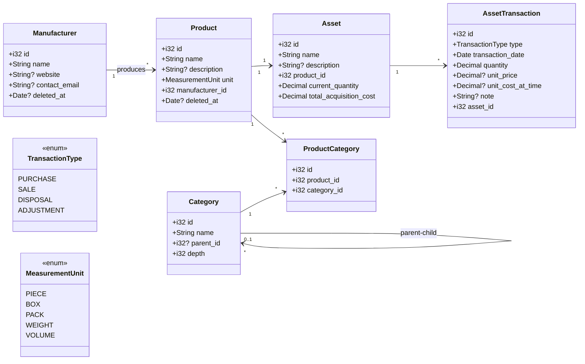

# Asset ドメイン UML 草案

Asset 境界づけられたコンテキストの主要エンティティと集約構造を整理したクラス図です。DDD 観点では`Product`集約と`Category`集約を分離し、`Asset`が個人資産の現在状況をキャッシュし、`AssetTransaction`でトランザクション履歴（購入・売却・廃棄）を時系列管理します。原価計算は移動平均法を採用します。

**主要な設計方針**:

- Category: 階層構造（`parent_id`, `depth`）、孤児昇格 + ハードデリート
- Product ⇔ Category: 多対多（`ProductCategory`中間テーブル）
- Asset / AssetTransaction: 削除不可（履歴保存）
- Manufacturer / Product: ソフトデリート（`deleted_at`）

## クラス図



## モデル構造メモ

### 基本エンティティ

- `Asset`は資産の集約根。`Product` と 1 対 1 で紐付き、名称と任意の説明を持つ。`current_quantity`（現在所有数）と`total_acquisition_cost`（総取得原価）をキャッシュ。所有状況は `current_quantity > 0` で判断。**削除不可**（履歴として永続保存）。
- `AssetTransaction`は資産の増減履歴。購入（PURCHASE）・売却（SALE）・廃棄（DISPOSAL）・調整（ADJUSTMENT）を時系列で記録。`Asset` と 1 対多で紐付く。**削除不可**（履歴は永続保存）。
  - `unit_price`: 購入時の単価、または売却時の売却価格
  - `unit_cost_at_time`: その時点での平均取得単価（売却時の損益計算用）
  - `note`: 取引メモ（「メルカリ売却」「故障により廃棄」など）
- `Product`は持ち物管理の主体。`Manufacturer` を参照し、`MeasurementUnit`で数量単位を表現。複数の `Category` に属することができる（多対多）。`deleted_at` でソフトデリート（Asset 紐付き時は削除拒否）。
- `TransactionType`は取引種別を定義する列挙型。

### マスタデータ

- `Manufacturer`は製造元のマスタ。名称は必須でユニーク制約を想定。`deleted_at` によるソフトデリート（論理削除）で使用可否を管理。Product 紐付き時は削除拒否。
- `Category`は商品分類の階層構造。`parent_id` による自己参照で無制限の階層を実現。`depth` で階層の深さをキャッシュ（パフォーマンス最適化）。**孤児昇格 + ハードデリート**（Product 紐付き時は削除拒否）。
- `ProductCategory`は `Product` と `Category` の多対多関係を管理する中間テーブル。

### カテゴリの階層構造

- `parent_id`: 親カテゴリの ID（null = ルートカテゴリ）
- `depth`: 階層の深さ（0 起点、ルート = 0）
- 循環参照の防止: 親変更時に子孫チェックを実施
- 削除時の挙動: 子カテゴリを親に昇格させてから削除（孤児昇格）

## 移動平均法による原価計算

移動平均法では、購入の都度、平均取得単価を再計算します。

### 計算例

**初期状態**

```
current_quantity: 0
total_acquisition_cost: 0
```

**1. 購入: 2 個 @ 5,000 円**

```
新しい数量: 0 + 2 = 2個
新しい総取得原価: 0 + 10,000 = 10,000円
平均取得単価: 10,000 ÷ 2 = 5,000円/個

→ Asset更新
  current_quantity: 2
  total_acquisition_cost: 10,000

→ AssetTransaction記録
  type: PURCHASE
  quantity: 2
  unit_price: 5,000
  unit_cost_at_time: 5,000
```

**2. 購入: 3 個 @ 4,000 円**

```
新しい数量: 2 + 3 = 5個
新しい総取得原価: 10,000 + 12,000 = 22,000円
平均取得単価: 22,000 ÷ 5 = 4,400円/個

→ Asset更新
  current_quantity: 5
  total_acquisition_cost: 22,000

→ AssetTransaction記録
  type: PURCHASE
  quantity: 3
  unit_price: 4,000
  unit_cost_at_time: 4,400
```

**3. 売却: 1 個 @ 3,500 円**

```
その時点の平均取得単価: 22,000 ÷ 5 = 4,400円/個
減らす原価: 4,400 × 1 = 4,400円

新しい数量: 5 - 1 = 4個
新しい総取得原価: 22,000 - 4,400 = 17,600円
平均取得単価: 17,600 ÷ 4 = 4,400円/個（変わらず）

売却損益: 3,500 - 4,400 = -900円（損失）

→ Asset更新
  current_quantity: 4
  total_acquisition_cost: 17,600

→ AssetTransaction記録
  type: SALE
  quantity: 1
  unit_price: 3,500（売却価格）
  unit_cost_at_time: 4,400（その時点の平均取得単価）
  note: "売却損益: -900円"
```

## 削除ポリシー

| エンティティ         | 削除方式                       | 条件                                             |
| -------------------- | ------------------------------ | ------------------------------------------------ |
| **Asset**            | 削除不可                       | 削除機能なし（履歴として永続保存）               |
| **AssetTransaction** | 削除不可                       | 履歴は永続保存                                   |
| **Product**          | ソフトデリート（`deleted_at`） | Asset 紐付き時は削除拒否                         |
| **Category**         | 孤児昇格 + ハードデリート      | Product 紐付き時は削除拒否、子カテゴリは親に昇格 |
| **Manufacturer**     | ソフトデリート（`deleted_at`） | Product 紐付き時は削除拒否                       |
| **ProductCategory**  | カスケード削除                 | Product 削除時に自動削除                         |

### Category 削除の詳細

```rust
pub async fn delete_category(category: &Category) -> Result<()> {
    // 1. Product紐付きチェック
    if category.has_products().await? {
        return Err("Cannot delete: category has products");
    }

    // 2. 子カテゴリを親に昇格（depth - 1）
    for child in category.get_children().await? {
        child.parent_id = category.parent_id;
        child.update_subtree_depth(-1).await?;
        child.save().await?;
    }

    // 3. 完全削除（ハードデリート）
    category.hard_delete().await?;
}
```

### 循環参照の防止

```rust
pub async fn change_parent(category: &mut Category, new_parent_id: Option<i32>) -> Result<()> {
    if let Some(pid) = new_parent_id {
        // 自分自身を親にできない
        if pid == category.id {
            return Err("Cannot set self as parent");
        }

        // 自分の子孫を親にできない
        if category.is_ancestor_of(pid).await? {
            return Err("Cannot create cycle");
        }
    }

    // depth更新処理...
}
```

## ユビキタス言語

Asset コンテキストで使用されるドメイン用語の定義です。

### 基本概念

#### Asset（資産）

個人が所有する物品の管理単位。Product と 1 対 1 で紐付き、現在の所有数量と取得原価を保持する。所有履歴は完全に保存され、削除されることはない。

**関連用語**:

- **所有状況**: `current_quantity > 0` で判断
- **所有中**: 数量が 1 以上の状態
- **過去に所有**: 数量がゼロだが記録は残っている状態

#### AssetTransaction（資産トランザクション）

資産の増減を記録する履歴。購入・売却・廃棄・調整の 4 種類がある。一度記録されたら変更・削除されることはない。

**トランザクション種別**:

- **PURCHASE（購入）**: 資産を取得した
- **SALE（売却）**: 資産を売却した
- **DISPOSAL（廃棄）**: 資産を廃棄した
- **ADJUSTMENT（調整）**: 数量や原価の調整

#### Product（商品）

持ち物の種類を表すマスタデータ。メーカーやカテゴリと紐付き、商品の基本情報を保持する。

**関連用語**:

- **商品マスタ**: Product のこと
- **廃番商品**: `deleted_at` が設定された Product

---

### カテゴリ体系

#### Category（カテゴリ）

商品を分類するための階層構造。親子関係により無制限の階層を持てる。

**階層用語**:

- **ルートカテゴリ**: `parent_id` が null のカテゴリ（最上位）
- **親カテゴリ**: 上位の階層
- **子カテゴリ**: 直接の下位階層
- **子孫カテゴリ**: すべての下位階層（子、孫、ひ孫...）
- **祖先カテゴリ**: すべての上位階層（親、祖父母...）
- **階層の深さ（depth）**: ルートから何階層目か（0 起点）

**カテゴリ操作**:

- **孤児昇格（Orphan Promotion）**: カテゴリ削除時に子カテゴリを親に繋ぎ直す操作
- **親子間挿入（Insert Between）**: 既存の親子の間に新しいカテゴリを挿入する操作
- **循環参照（Circular Reference）**: 自分の子孫を親にしてしまうエラー状態（禁止）

#### ProductCategory（商品カテゴリ紐付け）

Product と Category の多対多関係を管理する中間テーブル。1 つの商品が複数のカテゴリに属することができる。

---

### マスタデータ

#### Manufacturer（メーカー・製造元）

商品を製造する企業や組織。名称は一意である必要がある。

**関連用語**:

- **アクティブなメーカー**: `deleted_at` が null
- **削除済みメーカー**: `deleted_at` が設定されているが、既存商品との紐付きは維持

#### MeasurementUnit（単位）

商品の数量を表す単位。

**単位種別**:

- **PIECE（個）**: 個数で数える
- **BOX（箱）**: 箱単位
- **PACK（パック）**: パック単位
- **WEIGHT（重量）**: kg、g などの重量
- **VOLUME（容量）**: L、ml などの体積

---

### 原価計算

#### 移動平均法（Moving Average Method）

購入の都度、平均取得単価を再計算する原価計算方法。

**用語**:

- **平均取得単価**: `total_acquisition_cost ÷ current_quantity`
- **総取得原価（total_acquisition_cost）**: 現在所有している分の取得原価合計
- **その時点の平均取得単価（unit_cost_at_time）**: トランザクション発生時の平均単価（売却損益計算用）
- **売却損益**: 売却価格 - 平均取得単価

**計算プロセス**:

1. **購入時**: 新しい数量と金額を加算し、平均単価を再計算
2. **売却時**: その時点の平均単価で原価を減算し、損益を記録
3. **廃棄時**: 売却と同様に原価を減算（売却価格はゼロ）

---

### 削除と保存

#### ソフトデリート（Soft Delete / 論理削除）

データを物理的に削除せず、`deleted_at` に削除日時を記録する方式。

**適用対象**:

- Manufacturer
- Product

**用語**:

- **アクティブ**: `deleted_at` が null の状態
- **削除済み**: `deleted_at` が設定されている状態
- **復元**: `deleted_at` を null に戻す操作

**メリット**:

- 既存データとの整合性を維持
- 誤削除からの復元が可能
- 「いつ使わなくなったか」の履歴が残る

---

#### ハードデリート（Hard Delete / 物理削除）

データベースから実際にレコードを削除する方式。

**適用対象**:

- Category（孤児昇格後）

**理由**: 階層構造の柔軟な整理のため

---

#### 削除不可（Non-Deletable）

削除機能自体を提供しない方針。

**適用対象**:

- Asset（履歴として永続保存）
- AssetTransaction（履歴は変更・削除しない）

**理由**: 過去の所有履歴を完全に保持するため

---

#### 削除拒否（Delete Rejection）

特定条件下で削除を拒否するビジネスルール。

**ルール**:

- Manufacturer: Product に紐づいている場合は削除不可
- Category: Product に紐づいている場合は削除不可
- Product: Asset に紐づいている場合は削除不可

**目的**: データの整合性を保護

---

### ドメインロジック

#### 集約（Aggregate）

DDD における一貫性の境界。

**Asset 集約**:

- 集約根: Asset
- 集約内: AssetTransaction
- 整合性ルール: トランザクション追加時に Asset のキャッシュを更新

**Product 集約**:

- 集約根: Product
- 参照: Manufacturer, Category（多対多）

**Category 集約**:

- 集約根: Category
- 自己参照による階層構造

---

#### キャッシュ（Cache）

パフォーマンス最適化のため、計算結果を保存しておくこと。

**適用箇所**:

- `Asset.current_quantity`: トランザクションから計算可能だがキャッシュ
- `Asset.total_acquisition_cost`: トランザクションから計算可能だがキャッシュ
- `Category.depth`: 親を辿って計算可能だがキャッシュ

**更新タイミング**:

- Asset: トランザクション追加時に更新
- Category: 作成時、親変更時に更新

---

この UML とユビキタス言語をベースに、ドメイン層のエンティティ・値オブジェクト・リポジトリ IF を実装予定です。
