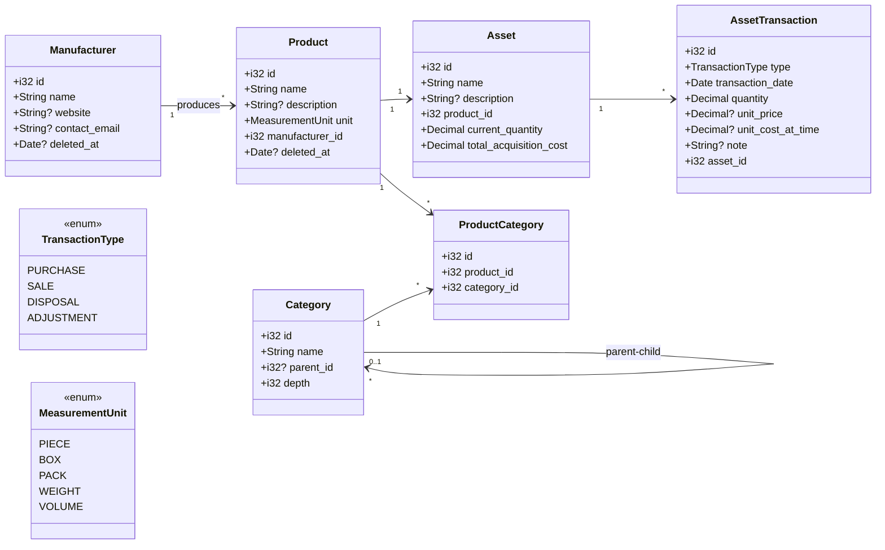

# Asset コンテキスト - モデル定義

Asset コンテキストの主要エンティティと集約構造を定義します。

---

## クラス図



---

## エンティティ定義

### Asset（資産）

個人が所有する物品の管理単位。Product と 1 対 1 で紐付き、現在の所有状況を保持します。

#### フィールド

| フィールド | 型 | 必須 | 説明 |
|-----------|-----|------|------|
| `id` | i32 | ✓ | 主キー |
| `name` | String | ✓ | 資産名（例: 「MacBook Pro 2024」） |
| `description` | String? |  | 説明・メモ |
| `product_id` | i32 | ✓ | 紐づく商品（UNIQUE制約） |
| `current_quantity` | Decimal | ✓ | 現在の所有数量（キャッシュ） |
| `total_acquisition_cost` | Decimal | ✓ | 総取得原価（キャッシュ） |

#### 特徴

- **削除不可**: 履歴として永続保存
- **所有判定**: `current_quantity > 0` で所有中と判断
- **集約根**: AssetTransaction を管理

---

### AssetTransaction（資産トランザクション）

資産の増減を時系列で記録する履歴エンティティ。

#### フィールド

| フィールド | 型 | 必須 | 説明 |
|-----------|-----|------|------|
| `id` | i32 | ✓ | 主キー |
| `type` | TransactionType | ✓ | トランザクション種別 |
| `transaction_date` | Date | ✓ | 取引日 |
| `quantity` | Decimal | ✓ | 増減数量 |
| `unit_price` | Decimal? |  | 購入単価または売却価格 |
| `unit_cost_at_time` | Decimal? |  | その時点の平均取得単価 |
| `note` | String? |  | 取引メモ |
| `asset_id` | i32 | ✓ | 紐づく Asset |

#### 特徴

- **削除不可**: 履歴は永続保存
- **更新不可**: 一度記録したら変更しない（調整は新規トランザクション追加）
- **トランザクション種別**: PURCHASE / SALE / DISPOSAL / ADJUSTMENT

---

### Product（商品）

持ち物の種類を表すマスタデータ。

#### フィールド

| フィールド | 型 | 必須 | 説明 |
|-----------|-----|------|------|
| `id` | i32 | ✓ | 主キー |
| `name` | String | ✓ | 商品名 |
| `description` | String? |  | 商品説明 |
| `unit` | MeasurementUnit | ✓ | 数量の単位 |
| `manufacturer_id` | i32 | ✓ | メーカー |
| `deleted_at` | Date? |  | 削除日（ソフトデリート） |

#### 特徴

- **ソフトデリート**: `deleted_at` で論理削除
- **削除拒否**: Asset に紐づいている場合は削除不可
- **多対多**: 複数の Category に属せる

---

### Category（カテゴリ）

商品を分類するための階層構造マスタ。

#### フィールド

| フィールド | 型 | 必須 | 説明 |
|-----------|-----|------|------|
| `id` | i32 | ✓ | 主キー |
| `name` | String | ✓ | カテゴリ名 |
| `parent_id` | i32? |  | 親カテゴリID（null = ルート） |
| `depth` | i32 | ✓ | 階層の深さ（0起点、キャッシュ） |

#### 特徴

- **階層構造**: `parent_id` による自己参照
- **孤児昇格**: 削除時に子カテゴリを親に昇格
- **ハードデリート**: 完全削除
- **削除拒否**: Product に紐づいている場合は削除不可
- **depth キャッシュ**: パフォーマンス最適化

---

### ProductCategory（商品カテゴリ紐付け）

Product と Category の多対多関係を管理する中間テーブル。

#### フィールド

| フィールド | 型 | 必須 | 説明 |
|-----------|-----|------|------|
| `id` | i32 | ✓ | 主キー |
| `product_id` | i32 | ✓ | 商品ID |
| `category_id` | i32 | ✓ | カテゴリID |

#### 特徴

- **ユニーク制約**: `(product_id, category_id)` の組み合わせは一意
- **カスケード削除**: Product 削除時に自動削除

---

### Manufacturer（メーカー）

商品を製造する企業や組織のマスタデータ。

#### フィールド

| フィールド | 型 | 必須 | 説明 |
|-----------|-----|------|------|
| `id` | i32 | ✓ | 主キー |
| `name` | String | ✓ | メーカー名（UNIQUE） |
| `website` | String? |  | ウェブサイトURL |
| `contact_email` | String? |  | 連絡先メール |
| `deleted_at` | Date? |  | 削除日（ソフトデリート） |

#### 特徴

- **ソフトデリート**: `deleted_at` で論理削除
- **削除拒否**: Product に紐づいている場合は削除不可
- **名称ユニーク**: 同名メーカーは登録不可

---

## 列挙型

### TransactionType（トランザクション種別）

資産の増減の種類を表す列挙型。

| 値 | 説明 |
|----|------|
| `PURCHASE` | 購入（資産を取得） |
| `SALE` | 売却（資産を売却） |
| `DISPOSAL` | 廃棄（資産を廃棄） |
| `ADJUSTMENT` | 調整（数量や原価の修正） |

---

### MeasurementUnit（単位）

商品の数量単位を表す列挙型。

| 値 | 説明 |
|----|------|
| `PIECE` | 個（個数で数える） |
| `BOX` | 箱（箱単位） |
| `PACK` | パック（パック単位） |
| `WEIGHT` | 重量（kg、g など） |
| `VOLUME` | 容量（L、ml など） |

---

## エンティティ間の関係性

### Product を中心とした関係

```
Manufacturer "1" --> "*" Product
  1つのメーカーが複数の商品を製造

Product "*" <--> "*" Category (via ProductCategory)
  1つの商品が複数のカテゴリに属し、
  1つのカテゴリが複数の商品を含む（多対多）

Product "1" --> "1" Asset
  1つの商品に対して1つの資産が紐付く
```

### Category の階層構造

```
Category "0..1" --> "*" Category (parent-child)
  カテゴリが親カテゴリを持つ（自己参照）
  parent_id が null の場合はルートカテゴリ

例:
  家電 (parent: null, depth: 0)
  └─ オーディオ機器 (parent: 家電, depth: 1)
     └─ イヤホン (parent: オーディオ機器, depth: 2)
```

### Asset とトランザクション

```
Asset "1" --> "*" AssetTransaction
  1つの資産が複数のトランザクション履歴を持つ

トランザクションは時系列で記録され：
  - 購入: current_quantity 増加
  - 売却/廃棄: current_quantity 減少
```

---

## 集約の境界

### Asset 集約

```
Asset（集約根）
  └─ AssetTransaction（集約内）
```

**整合性ルール**:
- トランザクション追加時に Asset のキャッシュ（`current_quantity`, `total_acquisition_cost`）を更新
- トランザクションと Asset の更新は同一トランザクション内で実行

---

### Product 集約

```
Product（集約根）
  ├─ Manufacturer（参照）
  └─ Category（多対多参照）
```

**整合性ルール**:
- Product 作成時に Manufacturer が存在することを確認
- Category との紐付けは ProductCategory 経由で管理

---

### Category 集約

```
Category（集約根）
  └─ Category（自己参照による階層）
```

**整合性ルール**:
- 親変更時に循環参照をチェック
- 削除時に子カテゴリを昇格
- depth は常に親の depth + 1 を維持

---

## データフロー例

### 商品購入の流れ

```
1. Product を作成（または既存を選択）
   └─ Manufacturer を参照
   └─ Category に紐付け（ProductCategory経由）

2. Asset を作成（Product と 1:1）
   └─ 初期状態: current_quantity = 0

3. AssetTransaction (PURCHASE) を追加
   └─ Asset.current_quantity += quantity
   └─ Asset.total_acquisition_cost += (quantity × unit_price)
```

### 商品売却の流れ

```
1. AssetTransaction (SALE) を追加
   └─ 平均取得単価を計算: total_acquisition_cost / current_quantity
   └─ Asset.current_quantity -= quantity
   └─ Asset.total_acquisition_cost -= (quantity × 平均取得単価)
   └─ 売却損益を記録: unit_price - unit_cost_at_time
```

---

## 参照

- [business-rules.md](./business-rules.md): 削除ポリシーと原価計算の詳細
- [database-design.md](./database-design.md): テーブル定義と制約
- [ubiquitous-language.md](./ubiquitous-language.md): ドメイン用語の定義

